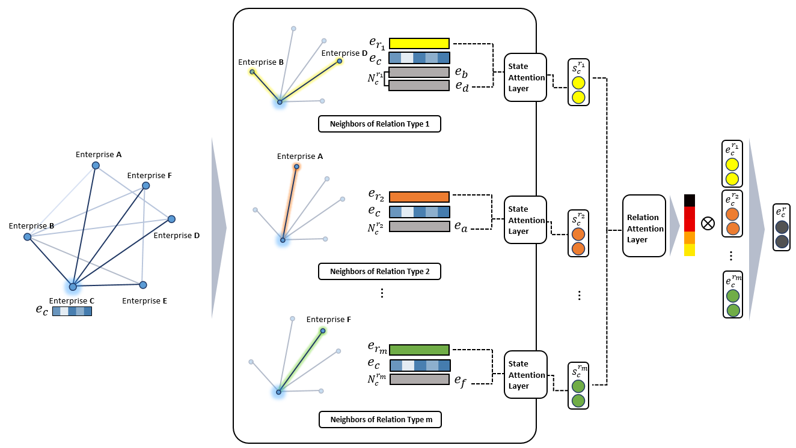

# HATS

This repository contains source codes of HATS, A Hierarchical Graph Attention Network for Stock Movement Prediction. As we conducted experiments on two different tasks, node classification and graph classification, we provide two different version of codes for each tasks. Please refer to our paper [HATS: A Hierarchical Graph Attention Network for Stock Movement Prediction](https://arxiv.org/abs/1908.07999) for further details.

## Requirements
Numpy 1.15.1 <br/>
Tensorflow 1.11.0

## Dataset
Price-realted data and corporate relation data is used for HATS. We gathered both data for S&P 500 listed companies from 2013/02/08 to
2019/06/17 (1174 trading days in total). Price data are gathered from [Yahoo Finance](https://finance.yahoo.com/) and corporate relation data are collected based on the information on [Wikidata](https://www.wikidata.org/wiki/Wikidata:Main_Page). Both datasets can be downloaded [here]()

## Usage
### Download Data
```
bash download.sh
```
### Excute model with makefile
```
make Makefile
```
